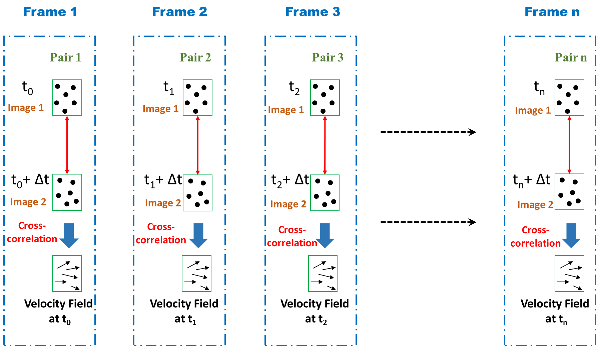
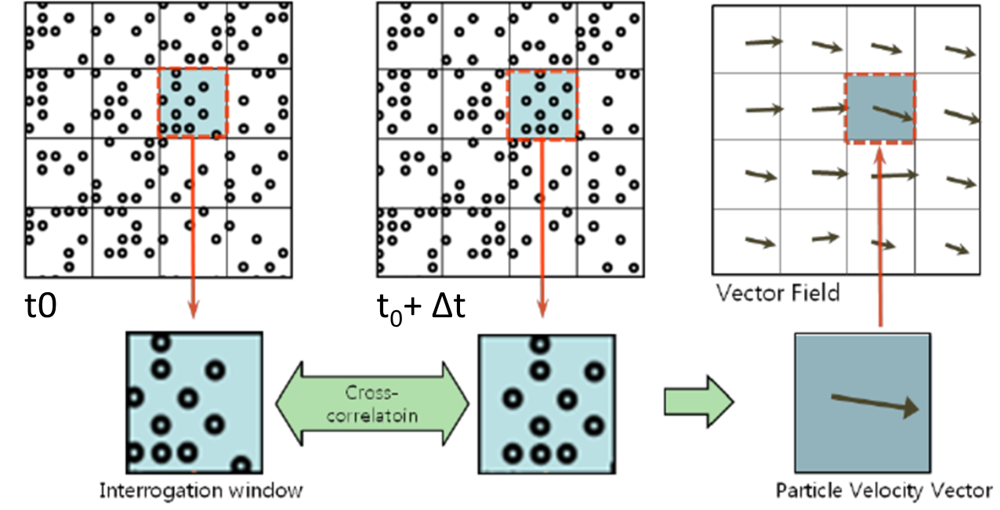
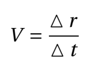

# Procedure:
1.	Fill up filtered water in the water tank of the e-PIV system.
2.	Mix some seeding particles in the water (accurate amount of seeding particles is determined through a few trials).
3.	Check all tubes connecting the water tank and transparent test section are properly connected.
4.	Place a geometry in the test section.
5.	Connect power cable of the e-PIV box.
6.	Connect the e-PIV box to a computer.
7.	Start the FlowEx software in the computer.
8.	Go to camera settings and check for air bubbles. Remove air bubbles if any.
9.	Adjust focus on seeding particles using manual focus.
10.	In pre-processing specify the number of images to be captured, delta time, and also specify the interrogation window size (these parameters are finalized through trial and error).
11.	Capture images and post-process using the system software (the images can also be processed outside the system separately using any open source PIV software).
12.	Post analysis the software provides vector plots of velocity field for each pair of images and it also provides an average velocity field.
13.	Corresponding to the velocity field x, y, u, and v data is also provided in output.

***1. Analyze the captured images using any open source PIV software to determine velocity field.***

## General Procedure

1. **Set Up the Experiment:**
    - Ensure the wind tunnel or flow facility is set up and operational.
    - Seed the flow with appropriate tracer particles, ensuring they are well distributed throughout the test section.
    - Align the laser system to generate a light sheet in the region of interest (extreme caution is advised and use of protective glasses are necessary).
    - Position the high-speed camera(s) to capture the flow at an optimal angle and distance.

2. **Calibration:**
    - Perform a calibration by measuring the scale of the system (e.g., pixel-to-metric distance conversion).
    - Ensure proper synchronization between the laser and the camera for accurate image capture.

3. **Image Acquisition:**
    - Capture two successive images at a known time interval Δt\Delta tΔt.
    - Adjust the exposure and frame rate of the camera to optimize particle visibility and minimize motion blur.

4. **Image Processing:**
    - Use the cross-correlation algorithm in the PIV software to calculate the displacement of particles.
    - Compute the velocity vectors from the displacement and construct the velocity field.

5. **Analysis:**
    - Analyze the velocity profiles, vortex patterns, or turbulence characteristics, depending on the nature of the flow under investigation.

##### Figure A: Basic Principle of frame by frame PIV Image Capture and Velocity Calculation

##### Figure B: Expanded view of Frame 1 showing division of each image into interrogation windows and applying cross-correlation to get a vector field.

## Setup and Working Principle

The figure A shows a schematic illustrating the Particle Image Velocimetry (PIV) process to measure velocity fields in fluid flows by capturing and analyzing the movement of tracer particles suspended in the fluid. Each frame (Frame 1, Frame 2, ..., Frame n) represents a snapshot in time of a PIV sequence.  Here's what happens in each frame:

### A. Image Pair Acquisition

- Sequence of image pairs at different time (t0, t1, t2, … tn) is taken, where each pair is captured at a fixed time interval Δt (usually microseconds apart).

- Top and bottom images in each pair show particles illuminated at two time instants separated by a very small interval Δt.

- The red arrows indicate these two images that are taken in quick succession — forming a pair (e.g., Pair 1, Pair 2, ... Pair n).

- These images are captured using double-frame camera exposure techniques or dual laser pulses.

### B. Interrogation Window and Displacement Detection

- The images are divided into small square regions, called interrogation windows (Figure B).

- Each pair of interrogation windows (from the two images in a pair) is compared to track the displacement of particles using cross-correlation algorithms.

- This process identifies how far and in what direction particles moved between the two exposures.

- Each interrogation window corresponds to one velocity vector in final vector field, i.e., more number of interrogation window will result in densely packed vector field.

- The size of interrogation window depends on several factor: flow velocity, unsteadiness in the flow, seeding density in the flow. 

- Too small interrogation window will have very few particles and also possibility movement of particles out of the window in the corresponding window of the pair, resulting in error.

### C. Velocity Vector Computation

The displacement vector (Δr) is divided by the known time interval (Δt) between the two exposures:

The result is a velocity vector (V) (black arrows in the bottom row of each frame) representing local flow velocity in that interrogation window.

### D. Repetition Over Multiple Frames

- The process is repeated across many frames (Frame 1 to Frame n), producing **time-resolved velocity fields.**

- This gives a time series of frames which in case of steady flow can be averaged to get a time averaged flow-field and in case of unsteady flow can be used to analyze turbulent flow, vortices, shear layers, and other dynamic phenomena in fluid mechanics.

### E. Important Notes:

- **Δt:** Laser pulse interval (controls accuracy of velocity).

- **Frame rate:** Camera speed (controls how often you capture images, independent of Δt).

- Velocity vectors are calculated **pairwise**, not across all frames at once.

- Each step in time gives you a **snapshot of the flow field.**

- Higher frame rate helps capture **transient or fast-changing flows.**