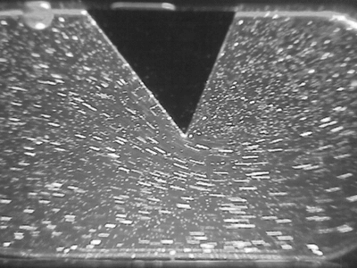
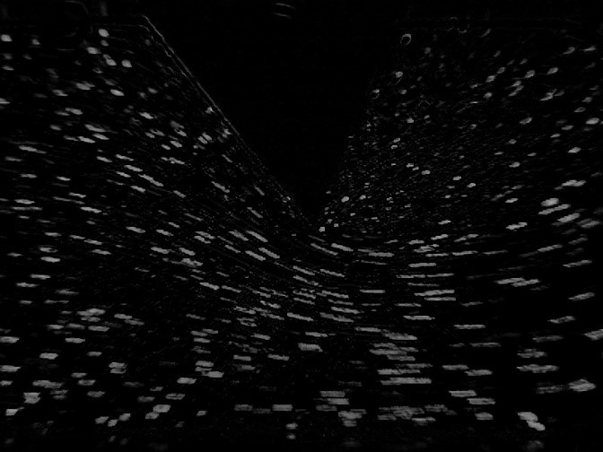
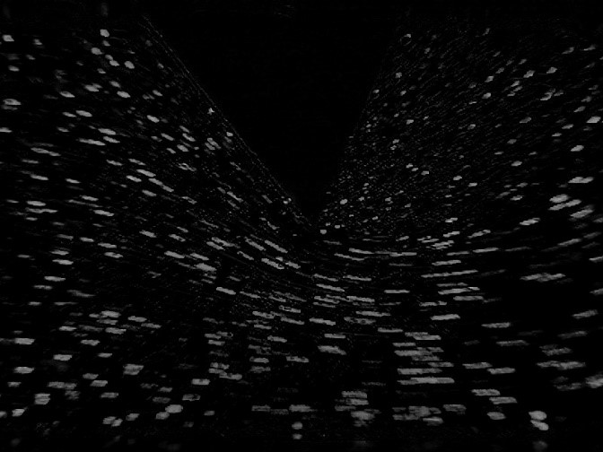
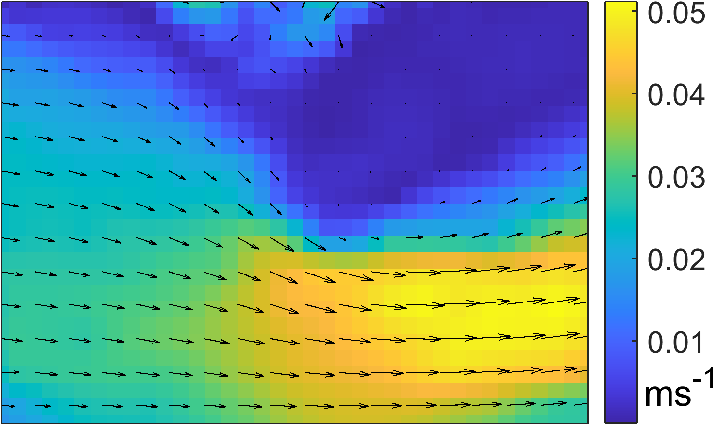

# Procedure:
1.	Fill up filtered water in the water tank of the e-PIV system.
2.	Mix some seeding particles in the water (accurate amount of seeding particles is determined through a few trials).
3.	Check all tubes connecting the water tank and transparent test section are properly connected.
4.	Place a geometry in the test section.
5.	Connect power cable of the e-PIV box.
6.	Connect the e-PIV box to a computer.
7.	Start the FlowEx software in the computer.
8.	Go to camera settings and check for air bubbles. Remove air bubbles if any.
9.	Adjust focus on seeding particles using manual focus.
10.	In pre-processing specify the number of images to be captured, delta time, and also specify the interrogation window size (these parameters are finalized through trial and error).
11.	Capture images and post-process using the system software (the images can also be processed outside the system separately using any open source PIV software).
12.	Post analysis the software provides vector plots of velocity field for each pair of images and it also provides an average velocity field.
13.	Corresponding to the velocity field x, y, u, and v data is also provided in output.

***1. Analyze the captured images using any open source PIV software to determine velocity field.***

### Results/Analysis:
1.	Results contain 12 consecutive frames captured using e-PIV. Below is a preview of the ani-mation of captured images.

Below are first two frames of the eleven frames from the above animation captured at Δt = 0.03 seconds from t=0 (Image 1) and Δt = 0.03 seconds from t1 (Image 2).

#### Image 1 at t1 = 0.03 s

#### Image 2 at t2 = 0.06 s

		          			            
2.	The pairs of images are processed to give velocity field. The processing can be done using an open source PIV tool e.g., PIVlab of Matlab. Each pair of images provides a set of velocity field. A contour of time-averaged velocity magnitude with an overlay of the velocity vector obtained using system software is given below.
 

