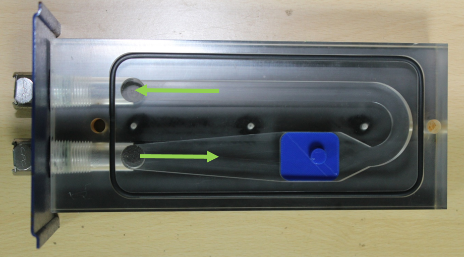
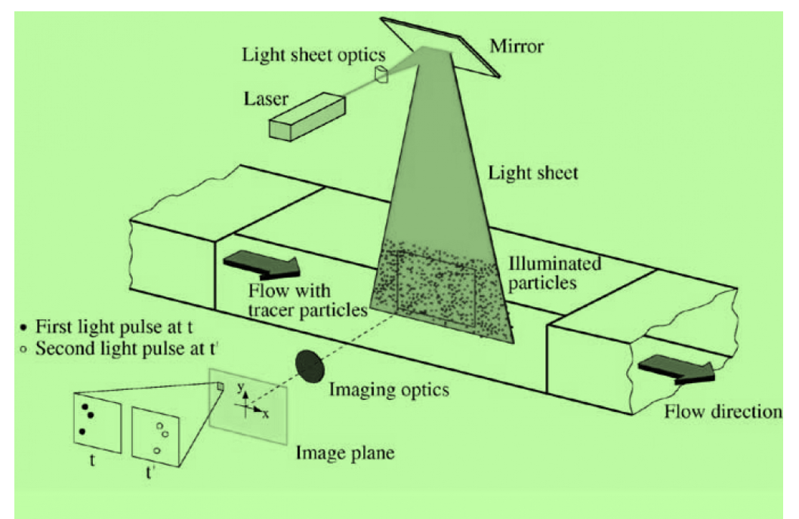

# Theory:

Particle Image Velocimetry (PIV) is a non-intrusive optical measurement technique used to obtain instantaneous velocity field measurements in fluid flows. PIV measures a planar velocity field over a designated region of interest. PIV works by seeding the flow with tracer particles that are assumed to follow the fluid motion accurately. These particles are illuminated using a laser sheet, and their positions are recorded at two successive time intervals (Δt) using a high-speed camera. A planar laser light sheet is placed in the region of interest to illuminate the particles, and a digital camera is oriented orthogonally to the light sheet. The camera is then digitally synchronized with the laser to capture the two successive images. By analyzing the displacement of particles between the two images, the velocity field of the flow can be determined.

The pair of images contains the pixel displacement of the particles for the selected pulse separation time. First, the images are divided into smaller interrogation windows, then a cross-correlation [1] or auto-correlation procedure is used to match the intensities of the particles between the two images within each small window. Based on these correlations the magnitudes and directions of the displacements are obtained and consequently the velocities.

According to the classification proposed by Hinsch, a measurement system can be labelled as (k, l, m), where k = 1, 2, 3 indicates the number of velocity components measured, l = 0, 1, 2, 3 indicates the number of spatial dimensions of the measurement domain, and m = 0, 1 indicates instantaneous or continuous time recording, respectively. Accordingly, even the best point-wise techniques can only attain a (3, 0, 1) status. In contrast, the simplest form of PIV provides two-dimensional velocity data on a planar domain at discrete time instants, i.e. (2, 2, 0). Stereoscopic PIV systems (3, 2, 1) which provide 3D velocity data on planar domains are becoming increasingly popular.

## Key Components of a PIV System

1. **Flow Facility:** The experimental setup usually consists of a wind tunnel, water tunnel, water tank or any other flow-generating device, where the fluid flow can be controlled and varied for different experiments.

2. **Tracer Particles:** These are small, spherical particles that are introduced into the flow. The particles should be small enough to follow the fluid motion but large enough to scatter light for image acquisition. The size and material of the particles depend on the fluid and the desired resolution.

3. **Laser:** A high-powered laser is used to illuminate the tracer particles. The laser typically produces a thin sheet of light (laser light sheet) that passes through the flow, causing the particles to reflect light, which is then captured by the camera. The laser should be dual pulse type, i.e., it can produce two pulses of light at a gap of very short time intervals (usually in hundreds of nanoseconds).

4. **Camera:** A high-speed digital camera (CMOS type) or charged couple device (CCD) camera is used depending on the requirement of the experiment, to capture the images of the illuminated particles. CCD cameras can capture images where the intensity of illumination is low and usually capture at low frame per seconds. Whereas, CMOS cameras capture at high frame rate and require high intensity of illumination.  The camera must be capable of taking images at very short time intervals, typically in the order of microseconds to milliseconds, to resolve the movement of the particles.

5. **Synchronizer:** The laser and the camera need to be synchronize in order to produce a perfectly timed image capture, i.e., the shutter camera should open when the flow is illuminated by the laser sheet. A synchronizer fulfils this purpose by sending an electrical pulse signal to each component at the same time. Using this multiple cameras and lasers can also be synchronized depending on requirement.

6. **Optical System:** This includes lenses, mirrors, and beam-splitters that direct the laser sheet into the flow and focus the image onto the camera sensor. Cameras are usually fitted with prime lens for sharp focus on the plane of interest. A cylindrical lens is required to convert a laser beam to a laser sheet. Depending on requirement other optics may be required, e.g., a mirror or light arm to direct laser beam towards the region of interest.

7. **Computational Software:** After the images are captured, specialized software is used to perform the image processing, which includes dividing the images into interrogation windows, performing cross-correlation, and calculating the velocity field.

## Theoretical Background of PIV

The PIV technique is based on tracking the displacement of tracer particles between two consecutive images. The key equations that govern this method are:

**Velocity Components:** The displacement of the tracer particles is used to determine the velocity components in the x and y directions (u = Δx/Δt and v = Δy/Δt).

Where:

- u and v are the velocity components in the x and y directions.

- Δx and Δy are the displacements of the particles in the x and y directions.

- Δt is the time interval between two consecutive images.

1. **Cross-Correlation Function:** The images are divided into small interrogation windows. The cross-correlation function is applied to these windows to determine the displacement of the particles:
    - The displacement corresponding to the peak value of the cross-correlation function gives the particle movement between the two images.

2. **Spatial Resolution:** The spatial resolution of the PIV system is dependent on the size of the interrogation windows and the pixel resolution of the camera. Smaller interrogation windows can resolve finer details of the flow, but they also tend to reduce the signal-to-noise ratio.

3. **Vector Field Calculation:** After calculating the displacement of particles in each window, the velocity field of the flow can be mapped by combining the displacements from all windows over the region of interest.

### The basic steps involved in a PIV experiment are as follows:

1. **Seeding the Flow:** Tracer particles are introduced into the fluid to make a homogeneous mixture. These particles must have similar density to the fluid so that they can follow the flow dynamics without significantly altering the flow itself.

2. **Illumination:** A laser is used to illuminate the tracer particles. The laser typically creates a thin sheet of light, which is aligned with the plane of interest in the flow field. The illuminated particles then reflect light and form images that are captured by high-speed cameras.

3. **Image Acquisition:** Two images are captured at a known time interval (Δt). The first image is recorded at time t0​ and the second one at time t0​+Δt. The displacement of the particles between these two images is used to calculate the velocity field.

4. **Cross-Correlation:** The images are divided into small interrogation windows. Cross-correlation techniques are applied to compare the particle patterns in the two images. The displacement of particles in each window gives the velocity vector in that region.

5. **Velocity Field Calculation:** Once the displacement for each interrogation window is obtained, the velocity vectors can be computed. The velocity of the fluid at each point is determined by the displacement of particles in that region, and these are then mapped across the flow field.

 ## Apparatus
- Educational-PIV (e-PIV) include Laser, Digital camera, Sheet optics, Water tank, Connecting tubes
- Transparent test section and Small scale bluff bodies or geometry
- Filtered water
- Seeding particles
- Image processing software

#### Figure 1: Transparent test section with a model

#### Figure 2: Schematic of PIV

## Specifications of the apparatus used:
- Camera: 640X480 pixel digital camera, 30fps.
- Laser: Class IIIb Laser with line generating lenses, wavelength 532 nm
- Geometry dimensions: 30mm long X 25mm wide X 5mm high
- Seeding particles: Polyamid (diameter = 50μ, specific gravity = 1.03)
- Image processing software: FLOWEX ®
