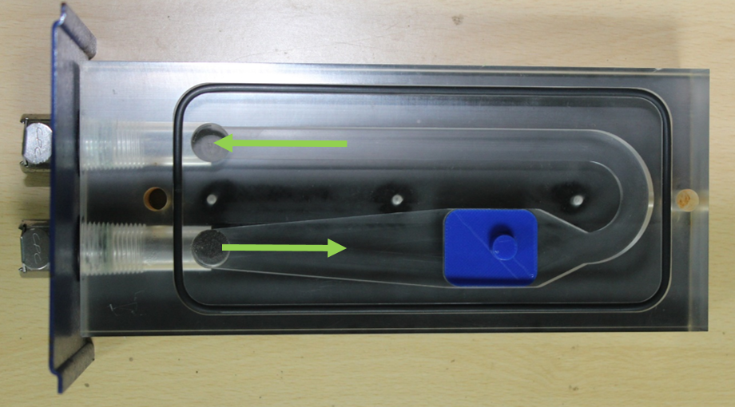
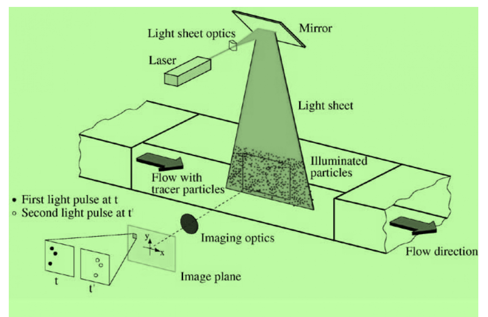

# Theory:

PIV is a flow measurement technique that measures a planar velocity field over a designated region of interest. The flow is uniformly seeded with tracer particles, which serve to track the flow. A planar laser light sheet is placed in the region of interest to illuminate the particles, and a digital camera is oriented orthogonally to the light sheet. The camera is uniformly focused over the region of interest. The seeded flow field is then illuminated twice within a small pulse separation time (Δt), which is of the order of microseconds. The camera is then digitally synchronized with the laser to capture the two successive images.

The pair of images contains the pixel displacement of the particles for the selected pulse separation time. First, the images are divided into smaller interrogation windows, then a cross-correlation [1] or auto-correlation procedure is used to match the intensities of the particles between the two images within each small window. Based on these correlations the magnitudes and directions of the displacements are obtained and consequently the velocities.

According to the classification proposed by Hinsch, a measurement system can be labelled as (k, l, m), where k = 1, 2, 3 indicates the number of velocity components measured, l = 0, 1, 2, 3 indicates the number of spatial dimensions of the measurement domain, and m = 0, 1 indicates instantaneous or continuous time recording, respectively. Accordingly, even the best point-wise techniques can only attain a (3, 0, 1) status. In contrast, the simplest form of PIV provides two-dimensional velocity data on a planar domain at discrete time instants, i.e. (2, 2, 0). Stereoscopic PIV systems (3, 2, 1) which provide 3D velocity data on planar domains are becoming increasingly popular.

 ## Apparatus
- Educational-PIV (e-PIV) include Laser, Digital camera, Sheet optics, Water tank, Connecting tubes
- Transparent test section and Small scale bluff bodies or geometry
- Filtered water
- Seeding particles
- Image processing software

#### Figure 1: Transparent test section with a model

#### Figure 2: Schematic of PIV

## Specifications of the apparatus used:
- Camera: 640X480 pixel digital camera, 30fps.
- Laser: Class IIIb Laser with line generating lenses, wavelength 532 nm
- Geometry dimensions: 30mm long X 25mm wide X 5mm high
- Seeding particles: Polyamid (diameter = 50μ, specific gravity = 1.03)
- Image processing software: FLOWEX ®
